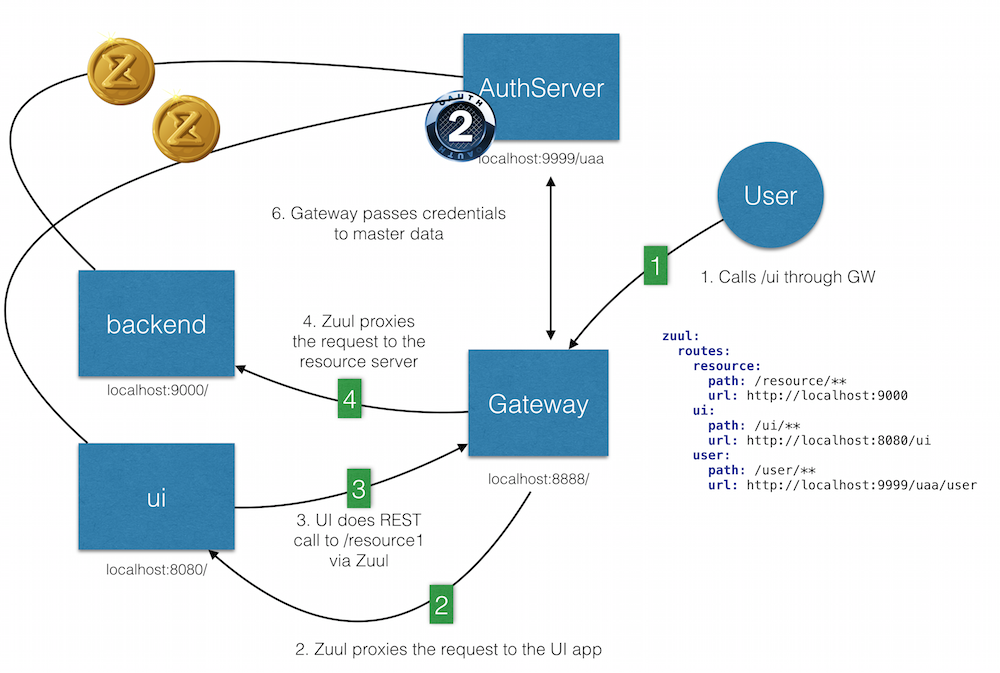

Contains a number of spring Boot Security / SSO samples.


# sample1

A simple authserver / gateway / ui / resource pattern.

- Everything goes through the gateway
- Authentication against an auth server
- Both UIs and Resources are behind gateway.
- Everything secured with Oauth2
- Out of the box config (simple annotations)




When accessing the UI directly (temporarily enabling basic authentication to bypass the authserver) I can access the protected resource.
```
Secure object: FilterInvocation: URL: /protected.html; Attributes: [hasRole('ROLE_USER')]
Previously Authenticated: org.springframework.security.authentication.UsernamePasswordAuthenticationToken@48ba0d1: Principal: org.springframework.security.core.userdetails.User@36ebcb: Username: user; Password: [PROTECTED]; Enabled: true; AccountNonExpired: true; credentialsNonExpired: true; AccountNonLocked: true; Granted Authorities: ROLE_ADMIN,ROLE_USER; Credentials: [PROTECTED]; Authenticated: true; Details: org.springframework.security.web.authentication.WebAuthenticationDetails@fffc7f0c: RemoteIpAddress: 0:0:0:0:0:0:0:1; SessionId: F54370F9513AE2EB79619859190CCCC7; Granted Authorities: ROLE_ADMIN, ROLE_USER
Voter: org.springframework.security.web.access.expression.WebExpressionVoter@2a54d2a7, returned: 1
Authorization successful

```

So the antMatchers work fine, and the protected.html can be seen by users with the proper role.


When accessing the UI through the gateway, I get redirected to the authserver (expected) and when passing authentication with a user with ROLE_USER, but I get this in the gateway logs :


```
2016-03-23 14:23:20.245 DEBUG 4194 --- [nio-8888-exec-3] o.s.s.w.a.i.FilterSecurityInterceptor    : Secure object: FilterInvocation: URL: /ui/protected.html; Attributes: [authenticated]
2016-03-23 14:23:20.245 DEBUG 4194 --- [nio-8888-exec-3] o.s.s.w.a.i.FilterSecurityInterceptor    : Previously Authenticated: org.springframework.security.oauth2.provider.OAuth2Authentication@402417f1: Principal: user; Credentials: [PROTECTED]; Authenticated: true; Details: remoteAddress=0:0:0:0:0:0:0:1, sessionId=<SESSION>, tokenType=bearertokenValue=<TOKEN>; Granted Authorities: {authority=ROLE_USER}
2016-03-23 14:23:20.245 DEBUG 4194 --- [nio-8888-exec-3] o.s.s.access.vote.AffirmativeBased       : Voter: org.springframework.security.web.access.expression.WebExpressionVoter@71da2205, returned: 1
2016-03-23 14:23:20.245 DEBUG 4194 --- [nio-8888-exec-3] o.s.s.w.a.i.FilterSecurityInterceptor    : Authorization successful
```

So I am seeing the OAuth2Authentication here, but this is on the gateway level where it sees /ui/protected.html. I don't think the gateway is the place to define fine-grained access control for my UI. (I want to do that in the UI itself)


However, In the UI logs (where I actually defined the authorization rules) I don't see the Oauth2Authentication anymore :

```
Secure object: FilterInvocation: URL: /protected.html; Attributes: [hasRole('ROLE_USER')]
Previously Authenticated: org.springframework.security.authentication.AnonymousAuthenticationToken@905571d8: Principal: anonymousUser; Credentials: [PROTECTED]; Authenticated: true; Details: org.springframework.security.web.authentication.WebAuthenticationDetails@0: RemoteIpAddress: 0:0:0:0:0:0:0:1; SessionId: CCF6C2F33B3794D28F3D45D20E59BAE0; Granted Authorities: ROLE_ANONYMOUS
Voter: org.springframework.security.web.access.expression.WebExpressionVoter@69681cd, returned: -1
AuditEvent [timestamp=Wed Mar 23 14:28:32 CET 2016, principal=anonymousUser, type=AUTHORIZATION_FAILURE, data={type=org.springframework.security.access.AccessDeniedException, message=Access is denied}]
Access is denied (user is anonymous); redirecting to authentication entry point
```


So it is not able to access the protected resource. 

```
curl -v -H "Cookie:JSESSIONID=728D85124207C56D56A856657046F4AA;" http://localhost:8888/ui/protected.html
*   Trying ::1...
* Connected to localhost (::1) port 8888 (#0)
> GET /ui/protected.html HTTP/1.1
> Host: localhost:8888
> User-Agent: curl/7.43.0
> Accept: */*
> Cookie:JSESSIONID=728D85124207C56D56A856657046F4AA;
> 
< HTTP/1.1 403 Forbidden
< Server: Apache-Coyote/1.1
< X-Content-Type-Options: nosniff
< X-XSS-Protection: 1; mode=block
< Cache-Control: no-cache, no-store, max-age=0, must-revalidate
< Pragma: no-cache
< Expires: 0
< X-Frame-Options: DENY
< X-Application-Context: bootstrap:8888
< X-Content-Type-Options: nosniff
< X-XSS-Protection: 1; mode=block
< Cache-Control: no-cache, no-store, max-age=0, must-revalidate
< Pragma: no-cache
< Expires: 0
< X-Frame-Options: DENY
< Set-Cookie: JSESSIONID=84C0D6801187087B5690A85F718DD408; Path=/ui/; HttpOnly
< Set-Cookie: XSRF-TOKEN=8ddd2a8b-1ace-4db3-a488-72c25ae64d50; Path=/
< Date: Wed, 23 Mar 2016 13:32:14 GMT
< Content-Type: application/json;charset=UTF-8
< Transfer-Encoding: chunked
< 
* Connection #0 to host localhost left intact
{"timestamp":1458739934740,"status":403,"error":"Forbidden","message":"Access Denied","path":"/ui/protected.html"}
```

It is able to access the oauth2 protected /resource endpoint thorugh the gateway

```
 curl -v -H "Cookie:JSESSIONID=728D85124207C56D56A856657046F4AA;" http://localhost:8888/resource
*   Trying ::1...
* Connected to localhost (::1) port 8888 (#0)
> GET /resource HTTP/1.1
> Host: localhost:8888
> User-Agent: curl/7.43.0
> Accept: */*
> Cookie:JSESSIONID=728D85124207C56D56A856657046F4AA;
> 
< HTTP/1.1 200 OK
< Server: Apache-Coyote/1.1
< X-Content-Type-Options: nosniff
< X-XSS-Protection: 1; mode=block
< Cache-Control: no-cache, no-store, max-age=0, must-revalidate
< Pragma: no-cache
< Expires: 0
< X-Frame-Options: DENY
< X-Application-Context: bootstrap:8888
< X-Content-Type-Options: nosniff
< X-XSS-Protection: 1; mode=block
< Cache-Control: no-cache, no-store, max-age=0, must-revalidate
< Pragma: no-cache
< Expires: 0
< X-Frame-Options: DENY
< Date: Wed, 23 Mar 2016 13:32:08 GMT
< Content-Type: application/json;charset=UTF-8
< Transfer-Encoding: chunked
< 
* Connection #0 to host localhost left intact
{"id":"ec7d167d-53b7-457c-995f-63d13ab7dbd1","content":"Hello World from resource"}
```


Some Questions :

If I want SSO via the GW to all my resources / UIs, I only need to have EnableOAuth2Sso on the gateway ?
My authorization rules can remain in the UIApplication ? These don't need to be moved to the gateway 


# References

https://github.com/spring-projects/spring-boot/issues/5482
